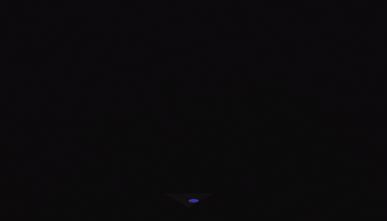

  

  

 

  &nbsp;
  &nbsp;
  &nbsp;
  

  &nbsp;&nbsp;
  

<!-- ═══════════════════ ABOUT ═══════════════════ -->

<table>
<tr>
<td width="60%" valign="top">

### Who I Am

Data Scientist and AI Systems Engineer with an **M.Sc. in Data Science** from the University of Kalyani, specializing in production-ready AI that bridges advanced academic research and enterprise engineering.

I drive technical innovation across dual capacities: as a **Data Scientist at Insightrix Consultancy**, and as a core engineer within the **RKMV R&D Cell in industry collaboration with FaceOff Technology**. Through these institutional roles and specialized consulting engagements, I architect end-to-end intelligence systems—spanning **speech forensics**, **multimodal deepfake detection**, **agentic RAG**, and **real-time telephony analysis**.

Published researcher at **ACL 2025** and **CLEF 2025**. Competed globally in multilingual NLP shared tasks.

> *"Whether leading R&D initiatives or consulting for commercial clients, I build systems that listen, reason, and deliver actionable intelligence—at scale and in real time."*

</td>
<td width="40%" valign="top" align="center">

 

</td>
</tr>
</table>

<!-- ═══════════════════ TECH STACK ═══════════════════ -->

<h2 align="center">Tech Arsenal</h2>

<table align="center">
<tr>
<td align="center" width="20%"><b>Category</b></td>
<td align="center" width="80%"><b>Technologies</b></td>
</tr>
<tr>
<td align="center"><b>Languages & Core Tools</b></td>
<td align="center">

</td>
</tr>
<tr>
<td align="center"><b>Speech & Audio AI</b></td>
<td align="center">

</td>
</tr>
<tr>
<td align="center"><b>NLP, LLMs & GenAI</b></td>
<td align="center">

</td>
</tr>
<tr>
<td align="center"><b>Computer Vision</b></td>
<td align="center">

</td>
</tr>
<tr>
<td align="center"><b>Backend, Cloud & MLOps</b></td>
<td align="center">

 

</td>
</tr>
<tr>
<td align="center"><b>ML & Data</b></td>
<td align="center">

</td>
</tr>
</table>

<!-- ═══════════════ INDUSTRY R&D ═══════════════ -->

<h2 align="center">Industry R&D — What I Build</h2>

  Architecture-level highlights from production systems built through an industry R&D incubation program. Descriptions are intentionally written at an architectural level to respect confidentiality while demonstrating technical depth.

 

<!-- DOMAIN 1 -->
<table>
<tr>
<td width="65%" valign="top">

### Voice Forensics & Speaker Intelligence

    

- Offline-first **target voice extraction** from degraded wiretap-quality recordings using speaker embeddings with adaptive quality gating
- **Dual-pass heuristic scanning** (600s sparse → 1.5s dense) for multi-hour inference with dynamic peak/sustained threshold enforcement
- Automated **speaker segmentation** with diarization-based identity canonicalization and cosine drift prevention
- **Court-admissible evidence packaging** — isolated WAV clips + JSON metadata + timestamped PDF forensic reports
- Browser-based **forensic audio editor** with multi-region waveform editing, effects chain, and undo/redo state management

</td>
<td width="35%" valign="top" align="center">

  

`PyTorch` `SpeechBrain` `ECAPA-TDNN`
`Silero VAD` `pyannote` `Librosa`
`Django` `Flask` `Celery` `Redis`

</td>
</tr>
</table>

<!-- DOMAIN 2 -->
<table>
<tr>
<td width="35%" valign="top" align="center">

  

`PyTorch` `WavLM` `Wav2Vec2`
`MediaPipe` `ViT` `OpenCV`
`FastAPI` `Twilio` `Django Channels`
`WebSockets` `Docker`

</td>
<td width="65%" valign="top">

### Deepfake Detection & Real-Time Threat Analysis

      

- **Multi-task audio deepfake detector** with learnable 12-layer aggregation, Transformer encoder, and jointly predicted real/fake + codec + attack-family classification heads
- Unified training across 4 benchmark datasets with **mislabeled sample correction** (+43% real data recovery) and production-grade augmentation (Opus/AMR codec, WebRTC effects, MUSAN noise)
- **6-class speech emotion recognition** (9,587 utterances, F1=0.71) with layer-wise attention and telephony-aware augmentation
- **Real-time telephony fraud screening** — live call analysis with deepfake risk scoring, emotion inference, and multilingual forensic summaries
- **Multimodal meeting security** — concurrent audio + video analysis over WebSocket streams with temporal smoothing and risk-level alerts

</td>
</tr>
</table>

<!-- DOMAIN 3 -->
<table>
<tr>
<td width="65%" valign="top">

### Conversational AI & Multimodal Assessment

      

- **Session-aware AI assistant** for audio/video case investigation with analysis-conditioned RAG prompting and persistent video-linked chat history
- **Real-time voice-to-voice AI assessment** platform with async orchestration running STT, speculative RAG pre-fetching, and continuous forensics as concurrent tasks
- **Tri-modal reasoning engine** fusing audio forensics (Wav2Vec2), text forensics (LLM linguistic analysis), and visual forensics (micro-expression/gaze/posture) into structured agentic decisions
- **Bidirectional PCM audio streaming** via Gemini Live API with auto-reconnection, fire-and-forget filler phrases, and sub-200ms perceptual latency

</td>
<td width="35%" valign="top" align="center">

  

`FastAPI` `WebSockets` `Gemini 2.5`
`Gemini Live API` `Milvus` `Wav2Vec2`
`Whisper` `Django` `asyncio`

</td>
</tr>
</table>

<!-- DOMAIN 4 -->
<table>
<tr>
<td width="35%" valign="top" align="center">

  

`Qwen-32B-AWQ` `DeepSeek-R1-7B`
`llama.cpp` `Milvus` `BGE-M3`
`BGE-Reranker` `HNSW` `Django`

</td>
<td width="65%" valign="top">

### Agentic RAG & Knowledge Intelligence

    

- **Dual-LLM agentic architecture** — Qwen-32B-AWQ (GPU, Flash Attention 2) as reasoning LLM + DeepSeek-R1-7B (CPU via llama.cpp) as critic model with singleton pattern
- **3-stage hybrid retrieval**: bi-encoder semantic search (HNSW on Milvus) → cross-encoder re-ranking → smart context stitching at sentence boundaries
- **ReAct agentic loop** with custom tool registry, multi-angle evidence injection, thought-based loop detection, and fallback summaries
- **Query Cognition layer** — LLM-powered intent classification, domain-jargon translation, and adaptive retrieval strategy injection
- Deployed over **streaming NDJSON endpoints** with real-time reasoning trace visualization and session-aware memory

</td>
</tr>
</table>

<!-- ═══════════════ RESEARCH ═══════════════ -->

<h2 align="center">Research & Publications</h2>

<table align="center">
  <tr>
    <td align="center" width="15%"></td>
    <td><b>ACL 2025 — SemEval Workshop (Vienna)</b> Multilingual claim retrieval using MiniLM + FAISS cross-lingual ranking — <i>published in ACL Anthology</i></td>
  </tr>
  <tr>
    <td align="center"></td>
    <td><b>CLEF 2025 — Working Notes (Madrid)</b> Dual-encoder scientific discourse detection (SciBERT + Twitter-RoBERTa), Macro F1 = 0.8262 — <i>published in CEUR-WS</i></td>
  </tr>
  <tr>
    <td align="center"></td>
    <td><b>DRDO-Funded Research</b> Multilingual Indian-language news claim verification (7000+ samples) with XLM-RoBERTa, MuRIL, GPT-4o Mini — <i>under review</i></td>
  </tr>
</table>

<!-- ═══════════════ PUBLIC REPOS ═══════════════ -->

<h2 align="center">Open Source Work</h2>

<table>
  <tr>
    <td width="50%" valign="top">
      <h3><a href="https://github.com/ArPaN-DS/music-mood-classification">music-mood-classification</a></h3>
      
Audio feature engineering (MFCCs, spectral contrast, chroma) + ML/DL for mood prediction. ~83% accuracy with Random Forest.

      
<code>Python</code> <code>Librosa</code> <code>scikit-learn</code>

    </td>
    <td width="50%" valign="top">
      <h3><a href="https://github.com/ArPaN-DS/Bank-Customer-Classification-MLP">Bank-Customer-Classification-MLP</a></h3>
      
Large-scale customer classification using MLP in PySpark with automated feature transformations and distributed preprocessing.

      
<code>PySpark</code> <code>MLP</code> <code>Big Data</code>

    </td>
  </tr>
  <tr>
    <td width="50%" valign="top">
      <h3><a href="https://github.com/ArPaN-DS/Fraud-Detection-Model-Development">Fraud-Detection-Model-Development</a></h3>
      
End-to-end fraud detection workflow with feature engineering, Random Forest achieving 94% accuracy, and precision/recall tuning.

      
<code>Python</code> <code>scikit-learn</code> <code>Pandas</code>

    </td>
    <td width="50%" valign="top">
      <h3><a href="https://github.com/ArPaN-DS/reddit-AI-bot">reddit-AI-bot</a></h3>
      
LLM-powered Reddit bot with OpenAI GPT for intelligent comment generation and real-time automated response loops.

      
<code>Python</code> <code>OpenAI</code> <code>PRAW</code>

    </td>
  </tr>
</table>

  
    More: <a href="https://github.com/ArPaN-DS/Web_scraping_of_News_Headlines">News Headlines Scraper</a> · <a href="https://github.com/ArPaN-DS/breast-cancer-diagnostic">Breast Cancer Diagnostic</a> · <a href="https://github.com/ArPaN-DS/Zomato-Data-Analysis">Zomato Analysis</a> · <a href="https://github.com/ArPaN-DS/Share-Trading-Data-Analysis">Share Trading Analysis</a>
  

<!-- ═══════════════ GITHUB ANALYTICS ═══════════════ -->

<h2 align="center">GitHub Analytics</h2>

  

  

<!-- ═══════════════ QUOTE ═══════════════ -->

  

<!-- ═══════════════ CONNECT ═══════════════ -->

<h2 align="center">Let's Connect</h2>

  &nbsp;
  &nbsp;
  

  Open to conversations around speech AI, multimodal intelligence, NLP systems, LLM engineering, and applied research.

  

